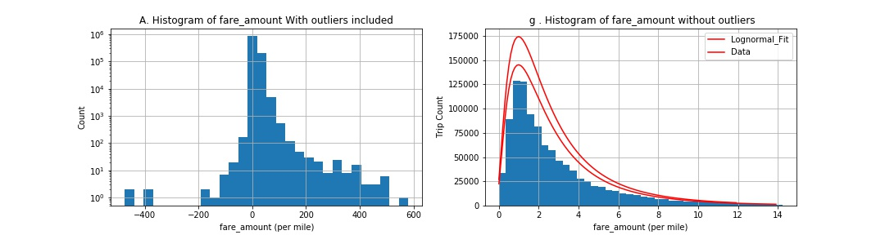

# New_York_City_Green_Taxi


Conntents of the repo 

1 .[The report](https://github.com/kayambi/Taxi_Cab_of_New_York/blob/master/README.md) in .md format in the subdir/Taxi_Cab_of_New_York/Taxi_Cab_of_New_York.md 


** Note:** This entire repo is available on my Demo 


```Python
import pandas as pd
import csv
import numpy as np
from datetime import datetime
import datetime as dt
from datetime import timedelta  # it is a spanned based time . 
from datetime import datetime, date, time
from datetime import date

import matplotlib.pyplot as plt
import os, json, requests, pickle
from scipy.stats import skew
from shapely.geometry import Point,Polygon,MultiPoint,MultiPolygon
from scipy.stats import ttest_ind, f_oneway, lognorm, levy, skew, chisquare

#import scipy.stats as st
from sklearn.preprocessing import normalize, scale
from tabulate import tabulate #pretty print of tables. source: http://txt.arboreus.com/2013/03/13/pretty-print-tables-in-python.html
from shapely.geometry import Point,Polygon,MultiPoint
%matplotlib inline
import warnings
warnings.filterwarnings('ignore')
! pip install shapely
! pip install shapely[vectorized]
!pip install git-lfs
from scipy.stats import chisquare 

# Analysis

In this notebook, I will explore data on New York City Green Taxi of [september 2015](http://www.nyc.gov/html/tlc/html/about/trip_record_data.shtml). I will start with some warm up questions about the dataset. Later, I will build a model to predict the percentage tip a driver would exepect on each trip. The code is fully written in python with few additional open-source libraries easy to install. 
- [shapely](https://pypi.python.org/pypi/Shapely)
- [scikit learn](http://scikit-learn.org/stable/)
- [tabulate](http://txt.arboreus.com/2013/03/13/pretty-print-tables-in-python.html)

In this analysis, some notion of statistics and hypothesis test are used but are very easy to follow. This [handbook of statistics](http://www.biostathandbook.com/index.html) can be used as a reference to explain basics.


## Start With Warm up

# Firs Step . Download Dataset and Print out the size. 
if os.path.exists('Data_Sptember.csv'):# check if the Data is present and load it . 
    data= pd.read_csv('Data_Sptember.csv')
# else: # Download Data Jan if not available on desktop . 
#     url = "https://s3.amazonaws.com/nyc-tlc/trip+data/green_tripdata_2019-01.csv"
#     data= pd.read_url('url')
#     data= Data.to_csv(url.split('/')[-1]
                      
                
# print number rows and number of columns 
print("Number of rows:",data.shape[0]) 
print("Number of columns:",data.shape[1])

Number of rows: 1048575
Number of columns: 21

### Let`s take a loo at the distribution of the trip distance.

``` Python 

# define the figure with 2 subplots
fig,ax = plt.subplots(1,2,figsize = (15,4)) 

# Histogram of Number of Trip distance 

data.Fare_amount.hist(bins=30 , ax = ax[0])
ax[0].set_xlabel('fare_amount (per mile)')
ax[0].set_ylabel('Count')
ax[0].set_yscale('log')
ax[0].set_title('A. Histogram of fare_amount With outliers included')

# Create a vector to contain  Trip Distance

v = data.Trip_distance
# # Exclude any data point that is further than 4 standard deviations of median point 
# and plot hist with 40 bin

v[~((v-v.median()).abs()>4*  v.std())].hist(bins=40, ax= ax[1])
ax[1].set_xlabel('fare_amount (per mile)')
ax[1].set_ylabel('Trip Count')
ax[1].set_title(' g . Histogram of fare_amount without outliers')

# Apply a lognormal fit . use the mean of Trip Distancce as the scale parameter 
Scatter,loc,mean = lognorm.fit(data.Trip_distance.values,
                               scale = data.Trip_distance.mean(), 
                                loc = 0 )
pdf_fitted = lognorm.pdf(np.arange(0,14,.1), Scatter , loc, mean)
ax[1].plot(np.arange(0,14,.1), 500000 * pdf_fitted, 'r')
ax[1].legend (['Data', 'lognorm fit '])

# # # create a vector to contain Trip Distance
v = data.Trip_distance 
# # exclude any data point located further than 3 standard deviations of the median point and 
# # plot the histogram with 30 bins


# apply a lognormal fit. Use the mean of trip distance as the scale parameter

scatter,loc,mean = lognorm.fit(data.Trip_distance.values,
                               scale=data.Trip_distance.mean(),
                               loc=0)
pdf_fitted = lognorm.pdf(np.arange(0,12,.1),scatter,loc,mean)
ax[1].plot(np.arange(0,12,.1),600000 * pdf_fitted,'r') 
ax[1].legend(['Lognormal_Fit', 'Data'])

# # export the figure
# plt.savefig('Question2.jpeg',format='jpeg')

plt.show()

```


The Trip Distance is asymmetrically distributed.It is skewed to the right and it has a median smaller than it`s mean and both smaller than the standard deviation. The skewness is due to the fact that the variable has a lower boundary of 0.The distance can't be negative. https://www.itl.nist.gov/div898/handbook/eda/section3/eda3669.htm

To the left is plotted the distribution of the entire raw set of Trip distance. To the right, outliers have been removed before plotting. Outliers are defined as any point located further than 3 standard deviations from the mean

The hypothesis: The trips are not random. If there were random, we would have a (symmetric) Gaussian distribution. The non-zero autocorrelation may be related the fact that people taking ride are pushed by a common cause, for instance, people rushing to work.

# We are going to examine if the time of the day has any impact on the trip distance. #


# First, convert pickup and drop off datetime variable in their specific righ format
data['lpep_pickup_dt'] = data.lpep_pickup_datetime.apply(lambda x:dt.datetime.strptime(x,"%m/%d/%y %H:%M"))
data['lpep_dropoff_dt'] = data.	Lpep_dropoff_datetime.apply(lambda x:dt.datetime.strptime(x,"%m/%d/%y %H:%M"))

# Second, create a variable for pickup hours
data['Pickup_hour'] = data.lpep_pickup_dt.apply(lambda x:x.hour)

# Mean and Median of trip distance by pickup hour
# I will generate the table but also generate a plot for a better visualization

fig,ax = plt.subplots(1,1,figsize=(9,5)) # prepare fig to plot mean and median values
# use a pivot table to aggregate Trip_distance by hour
table1 = data.pivot_table(index='Pickup_hour', values='Trip_distance',aggfunc=('mean','median')).reset_index()
# rename columns
table1.columns = ['Hour','Mean_distance','Median_distance']
table1[['Mean_distance','Median_distance']].plot(ax=ax)
plt.ylabel('Metric (miles)')
plt.xlabel('Hours after midnight')
plt.title('Distribution of trip distance by pickup hour')
#plt.xticks(np.arange(0,30,6)+0.35,range(0,30,6))
plt.xlim([0,23])
plt.savefig('Question3_1.jpeg',format='jpeg')
plt.show()
print ('-----Trip distance by hour of the day-----\n')
print (tabulate(table1.values.tolist(),["Hour","Mean distance","Median distance"]))


-----Trip distance by hour of the day-----

  Hour    Mean distance    Median distance
------  ---------------  -----------------
     0          3.1677               2.23
     1          3.0324               2.14
     2          3.0466               2.16
     3          3.19384              2.22
     4          3.5175               2.37
     5          4.12593              2.89
     6          4.07374              2.86
     7          3.33637              2.22
     8          3.10675              2.035
     9          3.04123              2
    10          2.95583              1.94
    11          2.92087              1.89
    12          2.89317              1.89
    13          2.87991              1.85
    14          2.85606              1.82
    15          2.87486              1.82
    16          2.78882              1.8
    17          2.70006              1.79
    18          2.68297              1.8
    19          2.75097              1.87
    20          2.79266              1.9
    21          3.03323              2.06
    22          3.24032              2.22
    23          3.26282              2.26

-> We observe long range trips in the morning and evenings. Are these people commuting to work? If so how do they get back home. The evening peak are shorter than the morning peak. I would hypothesize that people are okay to take cabs in the morning to avoid being late to their early appointments while they would take public transportation in the evening. However, this might not apply to NYC

***Let's also compare trips that originate (or terminate) from (at) one of the NYC airports. We can look at how many they are, the average fair, ...***

Reading through the dictionary of variables, I found that the variable RateCodeID contains values indicating the final rate that was applied. Among those values, I realized that there is Newark and JFK which are the major airports in New York. In this part, I will use this knowledge and group data with RateCodeID 2 (JFK) and 3 (Newark). - An alternative (which I didn't due to time constraint) is to (1) get coordinates of airports from google map or http://transtats.bts.gov (2) get at least 4 points defining a rectangular buffer zone near the airport (3) build a polygon shape using shapely [https://pypi.python.org/pypi/Shapely] and (3) check if any pickup/dropoff location coordinates is within the polygon using shapely again. This method was first tried but was found to be time consuming -

``` python
 
# Selecting airpor trips, finding the average of fare per trip, total amount charged. 
airports_trips = data[(data.RateCodeID== 1) | (data.RateCodeID == 3)]
print("Number of Trips to/ from NYC airports :" ,airports_trips.shape[0])
print("Average of Fare (calculated by meter) of trips to / from NYC airports: $ ",airports_trips.Fare_amount.mean(),"per trip")
print("Average Total Amount charged before the trips to / from NYC airports: $ ",airports_trips.Total_amount.mean(),"per trip")
print("Maximum of Fare (calculated by meter) of trips to / from NYC airports: $ ",airports_trips.Fare_amount.max(),"per trip")


Number of Trips to/ from NYC airports : 1020731
Average of Fare (calculated by meter) of trips to / from NYC airports: $  12.391516530799978 per trip
Average Total Amount charged before the trips to / from NYC airports: $  14.887327758421408 per trip
Maximum of Fare (calculated by meter) of trips to / from NYC airports: $  580.5 per trip


Now that we have seen the number and mean fare of airport trips, let's take a closer look at how trips are distributed by trip distances and hour of the day

``` python

# Create a vector to contain Trip Distance . 
v1 = airports_trips.Trip_distance
v2 = data.loc[~data.index.isin (v1.index),'Trip_distance'] # non- airport trips

# remove outliers : 
# Exclude any data point located further than 2 standard deviations of the median point and histogram with 30 bins 

v1 = v1[~((v1-v1.mean()).abs()>2*v1.std())]
v2 = v2[~((v2-v2.mean ()).abs()>2*v2.std())]

# # Define Bins bounries.

bins = np.histogram(v1, normed = True)[1]
h1 = np.histogram(v1, bins = bins , normed = True)
h2 = np.histogram(v2 , bins = bins , normed =True)

# # plots distribution of trips distance normilized among groups 

fig,ax = plt.subplots(1,2,figsize = (15,5))
w =.4 *(bins[1] - bins[0])
ax[0].bar(bins[:-1], h1[0], alpha =1 , width = w, color = 'y')
ax[0].bar(bins[:-1] + w, h2[0], alpha =1 , width = w, color = 'orange')
ax[0].legend(['Airport Trip','Non-airport trips '] , loc = 'best', title = 'Group')
ax[0].set_xlabel('Trip Distance(miles)')
ax[0].set_ylabel('Group Normalized Trips Count')
ax[0].set_title('A. Trip Distance Distribution')

#  Plot Hour Distribution  

airports_trips.Pickup_hour.value_counts(normalize=True).sort_index().plot(ax=ax[1])
data.loc[~data.index.isin(v1.index),'Pickup_hour'].value_counts(normalize=True).sort_index().plot(ax=ax[1])
ax[1].set_xlabel('Hours after midnight')
ax[1].set_ylabel('Group normalized trips count')
ax[1].set_title('B. Hourly distribution of trips')
ax[1].legend(['Airport trips','Non-airport trips'],loc='best',title='group')
# plt.savefig('Question3_2.jpeg',format='jpeg')
plt.show()


 
